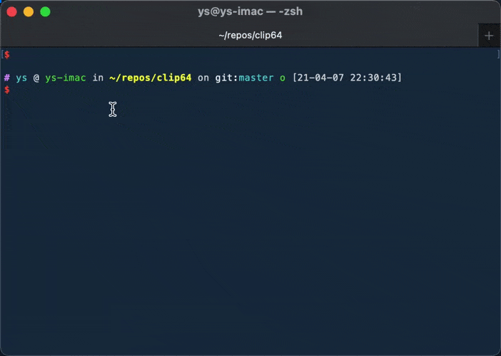

# clip64

A tiny cross-platform CLI tool to encode or decode base64 string in clipboard, it will replace the data in the clipboard:



## Installation

[Release page](https://github.com/ysmood/clip64/releases) or install with one CLI command:

```bash
curl -L https://git.io/fjaxx | repo=ysmood/clip64 sh
```
